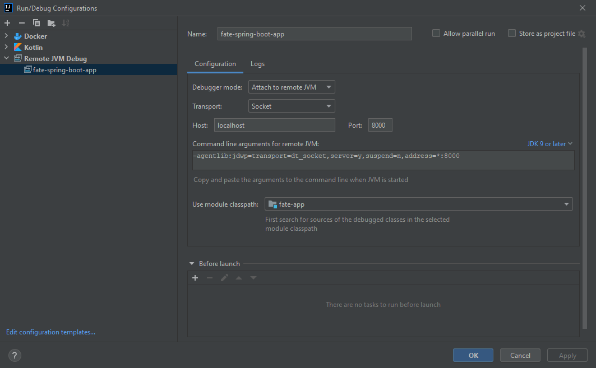

# FateSpringBootApp

This is a base repository for my digital playground and future reference for development.

In this repo, there are the following branches and their use:
- `/master`: for kotlin general development;
- `/feature/java`: for java general development;
- `/feature/mockito-junit5`: for examples and explanation about unit testing using JUnit5 and Mockito;
- `/feature/jackson-yml`: for example of reading YAML files, and handling data using Jackson dependency;
- `/feature/file-reading-writing`: for example of file reading and writing using Java NIO API;
- `/feature/bouncycastle-rsa-signature`: for example of RSA key pair generation and signature using BouncyCastle dependency;
- `/feature/checksum-generation`: for example of checksum generation;
- `/feature/jwt`: for example of authentication in REST API using JWT, and Swagger, in Spring Boot; 
- `/feature/oauth2`: for example of authentication in REST API using OAuth2;

The FateSpringBootApp is a Maven project created with Spring Boot as a starting framework.

## Running

In order to run the application, the `docker-compose` file was created to ease the execution.

To run the application, simply access the directory that contains the `docker-compose.yml` file in your 
preferred command terminal application and execute the following commands:

```shell
docker-compose up postgresql
docker-compose up mongodb
docker-compose up fate-spring-boot-app
```

These commands will create and run the dependant services along with the actual project application.

In addition, for ease of use, another service is present in the `docker-compose.yml` file: 
a pgadmin service, used for database navigation. 

Note that, for database navigation, you will need to connect to the postgresql server
specified using either the docker container IP in the network created, or the declared **testname** hostname.

Also, all credentials needed to access the pgadmin console and postgresql server declared in the pgadmin navigation UI are exposed 
in the same `docker-compose.yml` file.

## Acessing the API

Once the project is up and running, the API can be accessed via SwaggerUI on [this address](http://localhost:8080/fate/swagger-ui.html).

## HotSwapping code

The docker-compose created project application has the following ports enabled: 8080, 8000.

The 8080 port is used for web access (requests).

The 8000 port is used for remote access.

This enables the creation of configurations using modern IDEs which can use the remote debugging tools to remotely evaluate
process executions, and more importantly, hotswap code.

To create a config for remote debugging in IntelliJ use the following template in "Run" > "Edit configurations...":


Using this configuration with the running docker-compose project application, once a file is altered, just right-click the
file and select "Compile and reload file" from the context menu.

## Liquibase configuration

Liquibase is configured by default using the Spring Boot supported configuration via the `application.yml` file.
The resources located in `db/changelog/{...}` and `db/db.changelog-master.yml` define the change sets and changelogs for the Liquibase database migration tool.
Using this configuration, the changelog files would be declared manually with every new database relevant changes made (great for development purposes).

In case of production ready applications, the recommended configuration for changelog generation is the use of the Liquibase maven plugin and properties 
together with the creation of a `liquibase.properties` resource file into the `liquibase` directory.

For this demonstration application, the following configurations were used:

- Liquibase Maven Properties:
```xml
<properties>
    <!-- Other properties... -->
    <liquibase.version>4.7.1</liquibase.version>
    <liquibase.propertyFile>src/main/resources/liquibase/liquibase.properties</liquibase.propertyFile>
</properties>
```
- Liquibase Maven Plugin:
```xml
<plugins>
    <!-- Other plugins... -->
    <plugin>
        <groupId>org.liquibase</groupId>
        <artifactId>liquibase-maven-plugin</artifactId>
        <version>${liquibase.version}</version>
        <configuration>
            <!-- Use the liquibase.properties file as the main source of configuration -->
            <propertyFileWillOverride>true</propertyFileWillOverride>
            <propertyFile>${liquibase.propertyFile}</propertyFile>
        </configuration>
        <dependencies>
            <!-- This ensures the required dependencies are available to the plugin in the classpath -->
            <dependency>
                <groupId>org.springframework.boot</groupId>
                <artifactId>spring-boot-starter-data-jpa</artifactId>
                <version>${project.parent.version}</version>
            </dependency>
            <dependency>
                <groupId>org.springframework.boot</groupId>
                <artifactId>spring-boot-starter-web</artifactId>
                <version>${project.parent.version}</version>
            </dependency>
        </dependencies>
    </plugin>
</plugins>
```
- Liquibase properties file:
```properties
url: jdbc:postgresql://localhost:5432/postgres?currentSchema=fate
username: root
password: root
driver: org.postgresql.Driver

changeLogFile: src/main/resources/liquibase/db.changelog-master.xml
outputChangeLogFile: src/main/resources/liquibase/db.changelog-generated.xml

# Optional
verbose: true
```

Once the configuration is complete, just use the command `mvn liquibase:generateChangeLog` to generate the changelogs for the application.